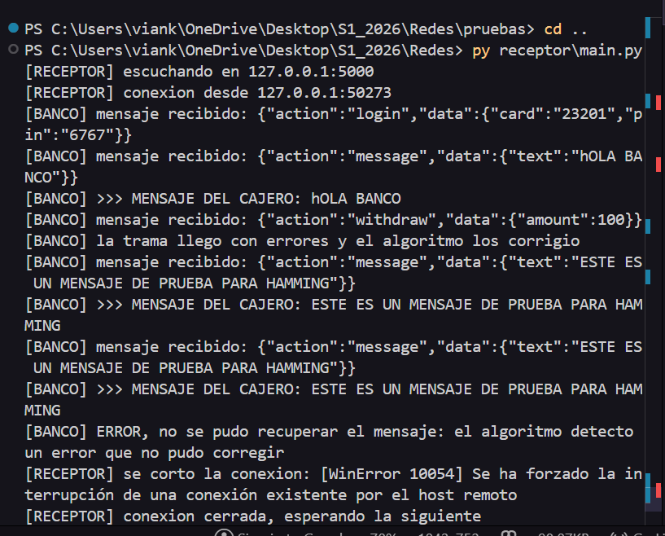
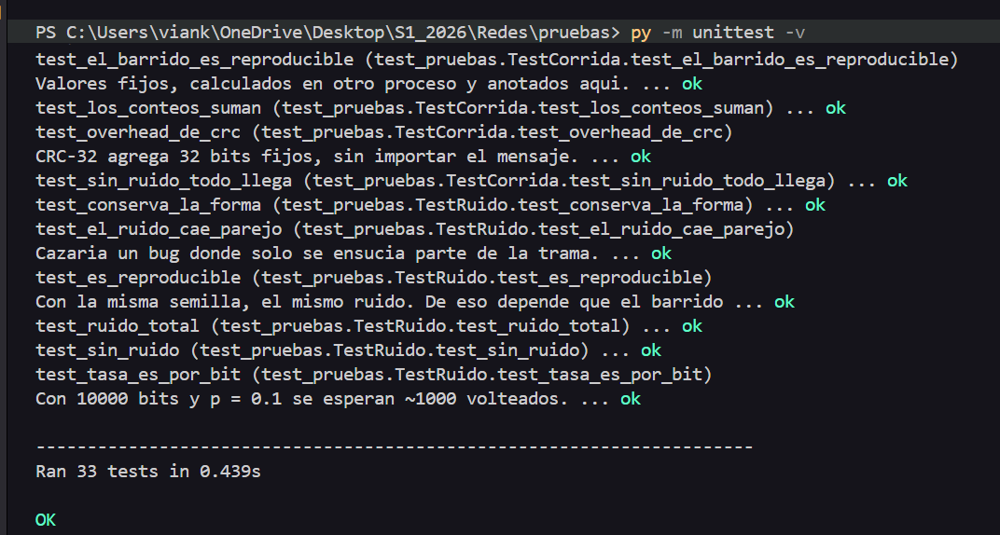
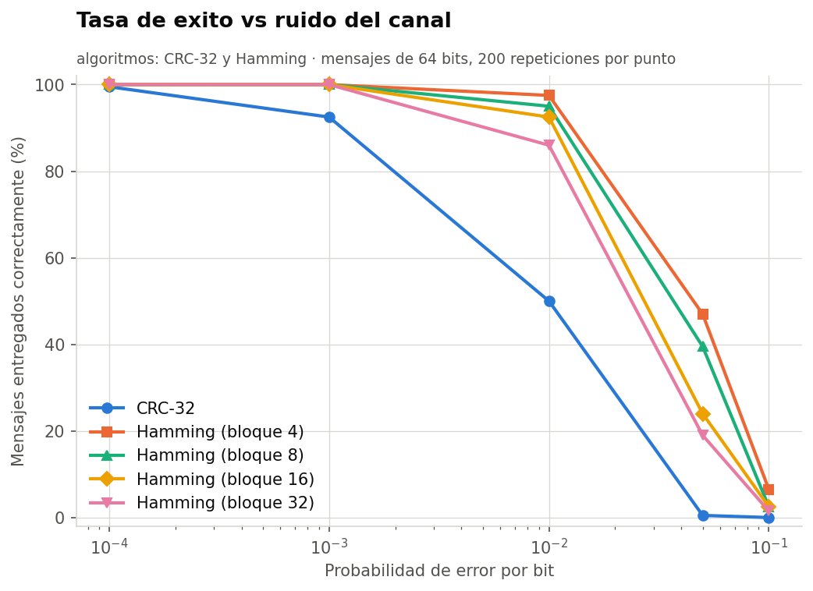
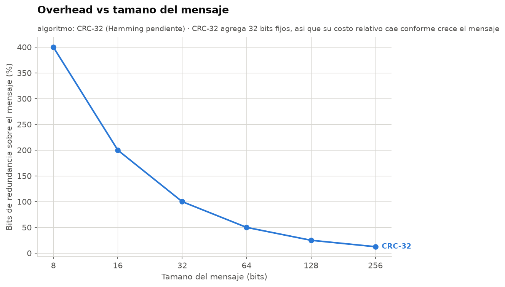
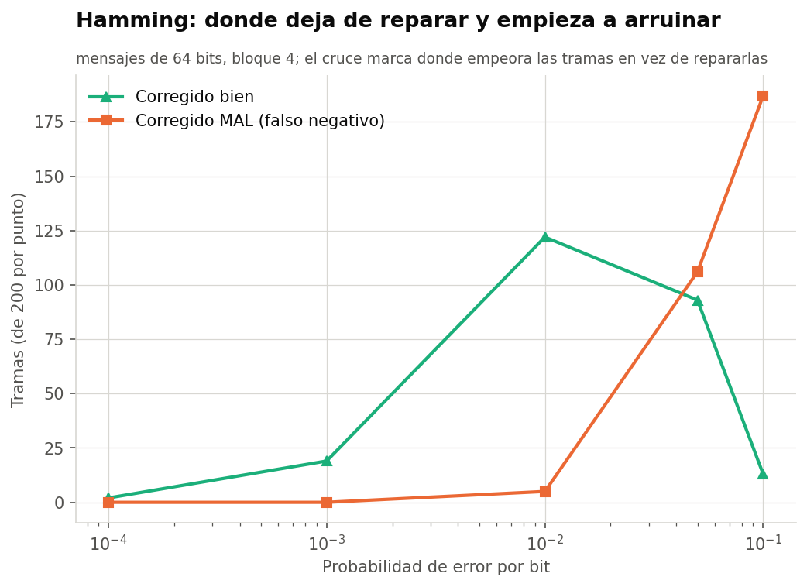
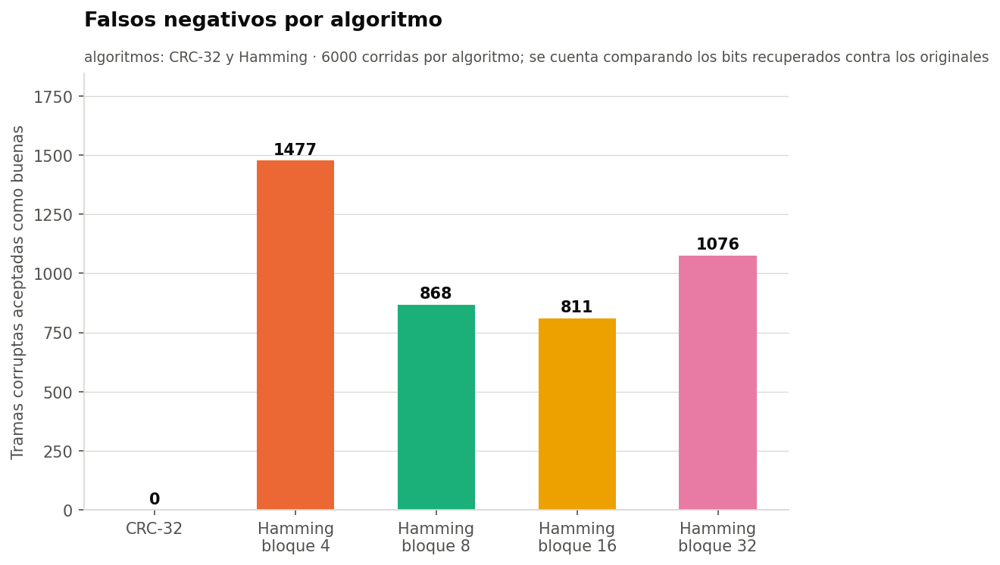
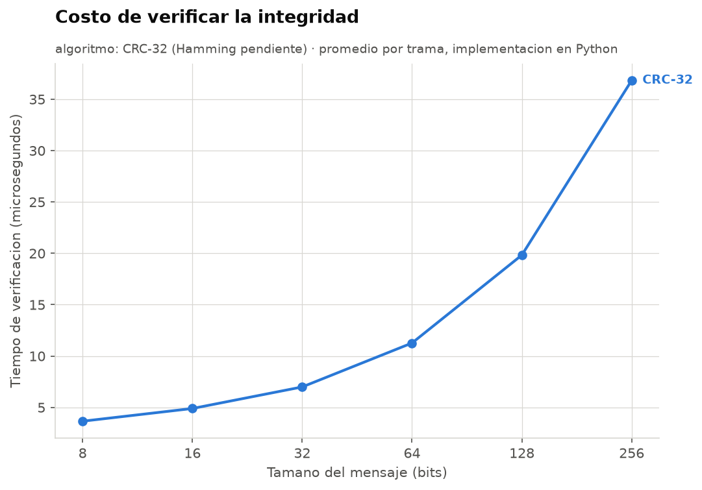

# Universidad del Valle de Guatemala

**Facultad de Ingeniería**  
**Departamento de Ciencias de la Computación**  
**CC3067 — Redes**

## Laboratorio 2  
## Esquemas de detección y corrección de errores

**Integrantes**

- Vianka — 23201
- Ricardo — 23247

---

# 1. Descripción de la práctica

En este laboratorio se desarrolló una aplicación que simula la comunicación entre un cajero automático y el servidor de una entidad bancaria mediante un canal no confiable.

El objetivo principal fue implementar una arquitectura por capas y comprobar el comportamiento de dos mecanismos de control de errores:

- **CRC-32**, utilizado para detectar alteraciones en una trama.
- **Código de Hamming**, utilizado para detectar y corregir errores de un bit por bloque.

El cajero automático funciona como emisor y fue implementado en **Go**. El servidor bancario funciona como receptor y fue implementado en **Python**. La comunicación entre ambos programas se realiza mediante sockets TCP sobre la dirección `127.0.0.1` y el puerto `5000`.

La aplicación permite:

- Iniciar sesión con tarjeta y PIN.
- Realizar retiros.
- Enviar mensajes libres al servidor.
- Elegir el algoritmo de integridad para cada transmisión.
- Elegir el tamaño de bloque cuando se utiliza Hamming.
- Definir una probabilidad de error por bit.
- Recibir una respuesta de aceptación, corrección o rechazo.

---

# 2. Arquitectura implementada

## 2.1 Emisor

En el emisor, el mensaje recorre las capas en el siguiente orden:

```text
Aplicación
    ↓
Presentación
    ↓
Enlace
    ↓
Ruido
    ↓
Transmisión
```

### Aplicación

La capa de aplicación representa el cajero automático. Solicita la información al usuario, construye las operaciones bancarias y muestra las respuestas recibidas.

### Presentación

La capa de presentación transforma cada byte del mensaje en una representación binaria de ocho bits.

Ejemplo:

```text
A → 01000001
```

### Enlace

La capa de enlace selecciona el algoritmo solicitado:

- `CRC` para CRC-32.
- `HAM` para código de Hamming.

Esta capa agrega los bits de redundancia antes de transmitir la trama.

### Ruido

La capa de ruido recorre la trama completa y decide de manera independiente si cada bit debe invertirse. La probabilidad indicada por el usuario representa la probabilidad de error de cada bit, no de la trama completa.

Los bits de redundancia también están expuestos al ruido.

### Transmisión

La capa de transmisión utiliza un socket TCP para enviar la trama al receptor. Cada trama termina con un salto de línea para delimitar correctamente los mensajes dentro del flujo TCP.

---

## 2.2 Receptor

En el receptor, la información recorre las capas en sentido inverso:

```text
Transmisión
    ↓
Enlace
    ↓
Presentación
    ↓
Aplicación
```

### Transmisión

El receptor permanece escuchando en el puerto `5000`. Cuando recibe datos, acumula los bytes en un buffer hasta encontrar el salto de línea que marca el final de una trama.

### Enlace

La capa de enlace verifica CRC-32 o ejecuta la decodificación de Hamming.

Los estados posibles son:

| Estado | Descripción |
|---|---|
| `ok` | La trama fue recibida sin errores detectables. |
| `corregido` | Hamming detectó y corrigió un error. |
| `error` | El mensaje no pudo recuperarse de manera segura. |

### Presentación

Si la trama fue aceptada, los bits recuperados se convierten nuevamente en texto UTF-8.

### Aplicación

La aplicación bancaria procesa las operaciones de:

- Inicio de sesión.
- Retiro.
- Envío de mensaje.
- Cierre de sesión.

---

# 3. Formato de transmisión

Las tramas se envían con el siguiente formato:

```text
ALGORITMO|TAMAÑO_BLOQUE|LONGITUD_ORIGINAL|TRAMA
```

Ejemplos:

```text
CRC|0|8|01000001...
HAM|4|8|0110011...
```

Los campos de la cabecera tienen las siguientes funciones:

| Campo | Función |
|---|---|
| Algoritmo | Indica si se utilizó CRC-32 o Hamming. |
| Tamaño de bloque | Se utiliza únicamente con Hamming. |
| Longitud original | Permite eliminar el relleno agregado por Hamming. |
| Trama | Contiene los datos y los bits de redundancia. |

El receptor contesta por la misma conexión:

| Respuesta | Significado |
|---|---|
| `ACK` | Mensaje recibido correctamente. |
| `ACK\|<json>` | Mensaje correcto con respuesta bancaria. |
| `ACK\|CORREGIDO` | Hamming corrigió un error. |
| `ACK\|CORREGIDO\|<json>` | Hamming corrigió un error y el banco respondió. |
| `NAK` | El mensaje fue rechazado. |

---

# 4. Algoritmos implementados

## 4.1 CRC-32

CRC-32 es un mecanismo de **detección de errores**. El algoritmo calcula un valor de 32 bits a partir de los datos originales y lo concatena al final de la trama.

La implementación utiliza la variante IEEE reflejada:

- Polinomio reflejado: `0xEDB88320`.
- Valor inicial: `0xFFFFFFFF`.
- XOR final: `0xFFFFFFFF`.
- Redundancia: 32 bits por mensaje.

El vector de comprobación utilizado fue:

```text
Entrada: 123456789
CRC-32 esperado: CBF43926
```

CRC-32 no intenta modificar ni reconstruir la información dañada. Cuando el valor recalculado no coincide con el recibido, el receptor descarta la trama y devuelve `NAK`.

Una característica importante es que el overhead de CRC-32 es fijo. Siempre se agregan 32 bits, sin importar el tamaño del mensaje.

---

## 4.2 Código de Hamming

Hamming es un mecanismo de **corrección de errores por bloques**.

El mensaje se divide en grupos de `m` bits y se calcula la cantidad mínima `r` de bits de paridad que satisface:

```text
m + r + 1 <= 2^r
```

Los bits de paridad se colocan en posiciones que son potencias de dos:

```text
1, 2, 4, 8, 16, 32...
```

Se implementaron tamaños de bloque configurables:

| Bits de datos `m` | Bits de paridad `r` | Tamaño codificado `n` |
|---:|---:|---:|
| 4 | 3 | 7 |
| 8 | 4 | 12 |
| 16 | 5 | 21 |
| 32 | 6 | 38 |

El tamaño predeterminado es de cuatro bits, correspondiente a Hamming(7,4).

Si el último bloque no contiene suficientes datos, se completa con ceros. La longitud real del mensaje se envía en la cabecera para que el receptor elimine este relleno después de decodificar.

En recepción se calcula el síndrome. Un síndrome igual a cero indica que no se encontró un error. Un valor distinto de cero señala la posición del bit que debe invertirse.

Hamming clásico corrige un error de un bit por bloque. Cuando ocurren varios errores dentro del mismo bloque, puede producir una corrección incorrecta. Por esta razón, las pruebas comparan los bits recuperados contra los originales y registran los falsos negativos.

---

# 5. Pruebas realizadas

Se realizaron pruebas unitarias, pruebas de integración y una simulación con múltiples combinaciones.

Las variables utilizadas en la simulación fueron:

| Variable | Valores |
|---|---|
| Algoritmo | CRC-32 y Hamming |
| Tamaño del mensaje | 8, 16, 32, 64, 128 y 256 bits |
| Probabilidad de error | 0.0001, 0.001, 0.01, 0.05 y 0.1 |
| Bloque Hamming | 4, 8, 16 y 32 bits |
| Repeticiones | 1000 por combinación |

Las métricas registradas fueron:

| Métrica | Significado |
|---|---|
| `ok` | El mensaje llegó correctamente y no necesitó corrección. |
| `corregido` | El mensaje fue recuperado correctamente por Hamming. |
| `detectado` | El algoritmo detectó el daño y rechazó la trama. |
| `falso_negativo` | La trama fue aceptada, pero los datos recuperados no coincidieron con los originales. |
| `overhead` | Proporción de bits adicionales respecto al mensaje original. |
| `us_encode` | Tiempo promedio de codificación en microsegundos. |
| `us_verify` | Tiempo promedio de verificación en microsegundos. |

Los datos completos se encuentran en:

```text
pruebas/resultados/metricas.csv
```

---

# 6. Evidencias de funcionamiento

## 6.1 Comunicación entre cajero y servidor 

La siguiente evidencia muestra al receptor escuchando en el puerto `5000`, la conexión del cajero, el inicio de sesión y la recepción de un mensaje libre.



**Figura 1.** Comunicación exitosa entre el emisor y el receptor.

---

## 6.2 Ejecución de pruebas automáticas

La siguiente captura presenta la ejecución de las pruebas implementadas para validar CRC-32, Hamming, la capa de ruido y el flujo completo.



**Figura 2.** Evidencia de las pruebas unitarias y de integración.

---

# 7. Resultados experimentales

## 7.1 Tasa de éxito frente al ruido



**Figura 3.** Porcentaje de mensajes entregados correctamente conforme aumenta la probabilidad de error por bit.

Esta gráfica permite comparar la capacidad de entrega de CRC-32 y Hamming bajo diferentes niveles de ruido.

CRC-32 acepta únicamente las tramas cuyo valor de verificación coincide. Cuando detecta una alteración, la trama se descarta. Por lo tanto, al aumentar el ruido disminuye la cantidad de mensajes entregados, aunque el algoritmo evita procesar información identificada como corrupta.

Hamming puede recuperar mensajes cuando existe un error corregible dentro de cada bloque. Su ventaja se observa principalmente con probabilidades bajas de error. Conforme aumenta el ruido, crece la posibilidad de que varios bits sean alterados dentro del mismo bloque.

---

## 7.2 Overhead frente al tamaño del mensaje



**Figura 4.** Relación entre la redundancia agregada y el tamaño del mensaje.

CRC-32 agrega 32 bits fijos. En mensajes pequeños esta cantidad representa una proporción considerable del total transmitido. Conforme aumenta el tamaño del mensaje, el costo relativo de esos 32 bits disminuye.

En Hamming, el overhead depende del tamaño de bloque. Los bloques pequeños incluyen más bits de paridad en proporción a los datos, pero ofrecen una mayor separación entre grupos de corrección. Los bloques grandes reducen el overhead relativo, aunque concentran más datos dentro de una misma unidad de corrección.

Este resultado muestra un compromiso entre eficiencia y tolerancia práctica al ruido.

---

## 7.3 Correcciones de Hamming



**Figura 5.** Correcciones exitosas y falsos negativos de Hamming conforme aumenta el ruido.

Con tasas bajas de error, Hamming puede identificar la posición de un bit alterado y restaurar correctamente el bloque.

Al incrementar la probabilidad de error, aumenta la posibilidad de que dos o más bits del mismo bloque sufran modificaciones. Hamming clásico no cuenta con suficiente información para distinguir de forma confiable todos estos casos.

La comparación entre correcciones exitosas y falsos negativos permite identificar el punto donde la corrección deja de ser una ventaja y comienza a introducir el riesgo de aceptar información diferente a la original.

---

## 7.4 Falsos negativos



**Figura 6.** Cantidad de tramas corruptas aceptadas como correctas.

Un falso negativo es especialmente importante porque el receptor considera que el mensaje fue recuperado correctamente, pero los datos no coinciden con los enviados.

CRC-32 está orientado a la detección y no intenta corregir los bits. Hamming, en cambio, puede aceptar un bloque después de modificar la posición indicada por el síndrome. Cuando existen errores múltiples, esa modificación puede producir datos incorrectos.

Por ello, no es suficiente contar únicamente cuántas veces un algoritmo devuelve `ok` o `corregido`. Es necesario comparar el resultado contra los bits originales, como se hizo en esta simulación.

---

## 7.5 Tiempo de verificación



**Figura 7.** Tiempo promedio requerido para verificar cada trama.

La medición del tiempo permite comparar el costo computacional de los algoritmos.

CRC-32 procesa los datos y recalcula un valor de 32 bits. Hamming debe separar la trama en bloques, calcular varios bits de paridad, construir el síndrome y, cuando corresponde, corregir una posición.

El tiempo también puede variar según el tamaño del mensaje y el tamaño de bloque seleccionado.

---

# 8. Discusión

## 8.1 ¿Qué algoritmo tuvo un mejor funcionamiento?

No existe un único algoritmo superior para todos los escenarios.

CRC-32 resulta apropiado cuando la prioridad es detectar corrupción y existe la posibilidad de retransmitir la información. Su comportamiento es conservador: si la trama no supera la verificación, se rechaza.

Hamming ofrece una ventaja cuando se desea recuperar el mensaje sin retransmitirlo y los errores son poco frecuentes y aislados. Sin embargo, su capacidad está limitada a un error corregible por bloque.

Por lo tanto:

- CRC-32 ofrece detección robusta y evita procesar tramas identificadas como dañadas.
- Hamming ofrece recuperación inmediata ante errores simples.
- La mejor elección depende del nivel de ruido y de si existe un mecanismo de retransmisión.

---

## 8.2 ¿Qué algoritmo es más flexible ante mayores tasas de error?

La respuesta depende de lo que se considere éxito.

CRC-32 puede seguir detectando que una trama fue modificada, pero no puede reconstruirla. A mayor ruido, aumenta la cantidad de mensajes descartados.

Hamming puede entregar mensajes corregidos con niveles bajos de ruido. Sin embargo, cuando la cantidad de errores por bloque aumenta, puede fallar o generar falsos negativos.

El tamaño de bloque influye directamente:

- Un bloque pequeño produce más overhead.
- Un bloque pequeño reduce la cantidad de bits expuestos dentro de una misma unidad de corrección.
- Un bloque grande reduce el overhead.
- Un bloque grande incrementa la posibilidad de errores múltiples dentro del mismo bloque.

---

## 8.3 ¿Cuándo es mejor utilizar detección en lugar de corrección?

La detección de errores es preferible cuando:

- Existe un canal de retorno.
- Es posible solicitar retransmisión.
- La integridad tiene prioridad sobre la entrega inmediata.
- El canal puede generar más errores de los que un código corrector sencillo puede manejar.

La corrección de errores es preferible cuando:

- Retransmitir es costoso o imposible.
- El retardo debe mantenerse bajo.
- Los errores esperados son aislados.
- El sistema debe recuperar la información sin solicitar una nueva transmisión.

En este proyecto, CRC-32 devuelve `NAK` para solicitar que la operación se intente nuevamente, mientras que Hamming intenta recuperar la trama en el receptor.

---

# 9. Conclusiones

1. La arquitectura por capas permitió separar las responsabilidades de aplicación, presentación, enlace, ruido y transmisión, facilitando las pruebas y el mantenimiento de cada componente.

2. La comunicación entre un emisor desarrollado en Go y un receptor desarrollado en Python demostró que es posible mantener un protocolo común mediante un formato de trama claramente definido.

3. CRC-32 permitió detectar alteraciones en los datos y descartar las tramas que no superaron la verificación, aunque no ofrece capacidad de corrección.

4. Hamming permitió corregir errores simples por bloque, pero su confiabilidad disminuyó cuando varios bits del mismo bloque fueron alterados.

5. El tamaño de bloque de Hamming establece un compromiso entre overhead y exposición a errores múltiples. Los bloques pequeños agregan más redundancia, mientras que los bloques grandes reducen el costo relativo.

6. La probabilidad de error por bit y el tamaño de la trama influyen directamente en la posibilidad de que un mensaje llegue correctamente.

7. La comparación con los bits originales fue necesaria para identificar falsos negativos que no podrían observarse únicamente mediante el estado reportado por el algoritmo.

8. La elección entre detección y corrección debe considerar el nivel de ruido, la disponibilidad de retransmisión y el costo de enviar información redundante.

---

# 10. Análisis

El laboratorio nos permitió observar de forma práctica que la transmisión confiable no depende únicamente del uso de sockets. Incluso cuando la conexión TCP funciona correctamente, la información puede modelarse como expuesta a alteraciones durante su recorrido.

La implementación de CRC-32 y Hamming permitió comparar dos estrategias diferentes: rechazar una trama dañada o intentar corregirla. Las simulaciones también mostraron que agregar redundancia tiene un costo y que una mayor capacidad de corrección no significa que el algoritmo sea infalible.

---

# 11. Referencias

1. Universidad del Valle de Guatemala. *Laboratorio 2: Esquemas de detección y corrección de errores*. Curso CC3067 Redes, 2026.

2. IEEE. *IEEE Standard for Ethernet*. Especificación del mecanismo CRC-32 utilizado en Ethernet.

3. Hamming, R. W. “Error Detecting and Error Correcting Codes.” *Bell System Technical Journal*, vol. 29, no. 2, 1950, pp. 147–160.

4. The Go Authors. *Go Documentation: net package*.

5. Python Software Foundation. *Python Documentation: socket module*.

---

# Anexo A. Comandos de ejecución

## Receptor

```powershell
py receptor\main.py
```

## Emisor

```powershell
cd emisor
go run .
```

## Pruebas del emisor

```powershell
cd emisor
go test ./...
```

## Pruebas del receptor

```powershell
cd receptor
py -m unittest -v
```

## Pruebas de simulación

```powershell
cd pruebas
py -m unittest -v
```

## Generación de métricas

```powershell
cd pruebas
py simulacion.py
```

## Generación de gráficas

```powershell
cd pruebas
py graficas.py
```

---

# Anexo B. Archivos de resultados

```text
pruebas/resultados/
├── 1_exito_vs_ruido.png
├── 2_overhead.png
├── 3_hamming_correcciones.png
├── 4_falsos_negativos.png
├── 5_tiempo_verificacion.png
├── capturas.png
├── pruebas.png
└── metricas.csv
```
